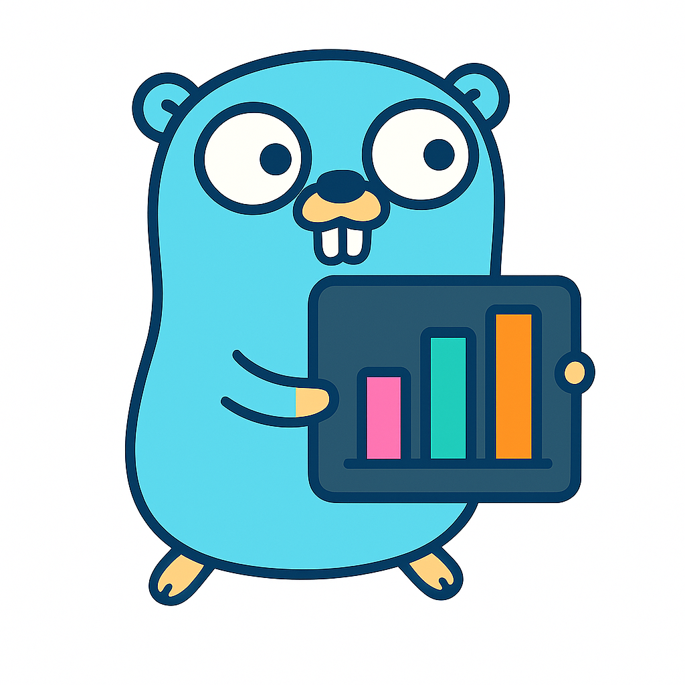
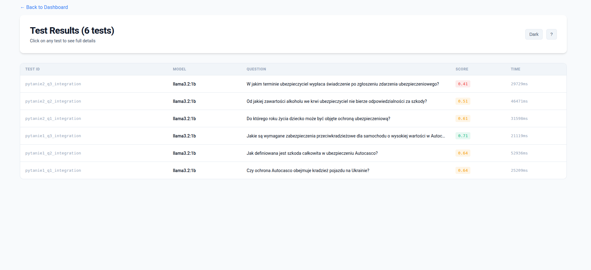
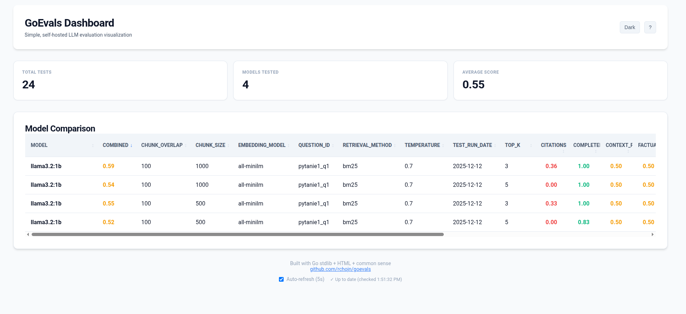
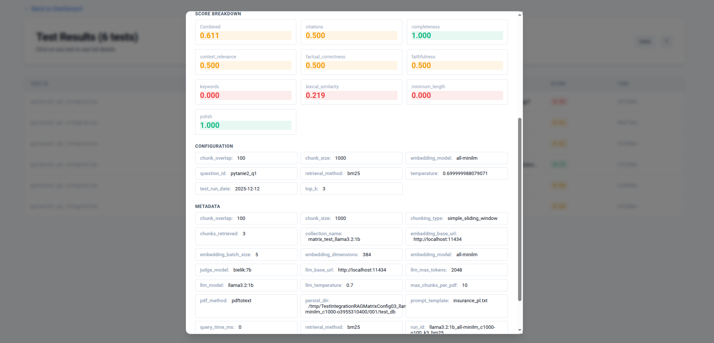

<div align="center">
  

  # GoEvals

  **Fast, local-first LLM evaluation dashboard with universal JSONL support**

  [](https://github.com/rchojn/goevals/actions/workflows/ci.yml)
  [](https://goreportcard.com/report/github.com/rchojn/goevals)
  [](https://go.dev)
  [](LICENSE)

  

  *Professional dashboard with dynamic columns that adapt to your custom metrics*
</div>

---

## Why GoEvals?

Most LLM evaluation dashboards are either **cloud-only** (vendor lock-in), **Python-heavy** (complex setup), or **overkill** (full observability platforms with databases).

**GoEvals** is different:

- **Single binary** - No Python, no Docker, no dependencies
- **Local-first** - Your data stays on your machine
- **Smart refresh** - Polls for new results without flickering (5s intervals)
- **Fast** - Starts in <100ms, handles thousands of evals
- **Simple** - Works with standard JSONL files

Built for **Go developers creating AI applications** who want a lightweight, hackable eval dashboard.

---

## Screenshots

### Main Dashboard


*Model comparison table with dynamic columns for custom RAG parameters (chunk_size, temperature, top_k, etc.)*

### Test Details Table


*Clean table view with clickable rows for detailed inspection*

### Test Modal


*Full test details including question, model response, expected answer, score breakdown, and configuration*

---

## Features

### Core Features
- **Universal JSONL** - Automatically detects ALL custom fields and scores from your data
- **Dynamic columns** - Table adapts to show any RAG parameters (chunk_size, temperature, embedding_model, etc.)
- **Smart polling** - Efficient updates without full page reload (5s intervals)
- **Sortable columns** - Click any header to sort by that metric
- **Color-coded scores** - Instant visual feedback (green >0.7, yellow 0.4-0.7, red <0.4)
- **Professional UI** - Modern modal-based design like Linear/Vercel/Stripe
- **Dark mode** - Built-in dark theme with localStorage persistence
- **Multiple files** - Load and compare results from multiple JSONL files

### Dashboard Views
- **Overview** - Total tests, models tested, average scores
- **Model comparison** - Side-by-side metrics with min/max/avg, shows ALL custom parameters
- **Test details** - Table view with modal dialogs for full question, response, and scoring breakdowns

---

## Quick Start

### Using Make (Recommended)

```bash
# Clone the repository
git clone https://github.com/rchojn/goevals
cd goevals

# See all available commands
make help

# Build binary
make build

# Run with empty dashboard (no data needed)
make run-empty

# Run with your data
make run  # requires evals.jsonl in current directory

# Run tests
make test

# Format code and check quality
make check
```

**Windows users:** Use `.\task.ps1 <command>` instead of `make` (PowerShell script with same targets).

### Manual Commands

```bash
# Build binary
go build -o bin/goevals main.go

# Run with sample data
./bin/goevals evals.jsonl

# Run on custom port
PORT=8080 ./bin/goevals evals.jsonl

# Compare multiple test runs
./bin/goevals run1.jsonl run2.jsonl run3.jsonl

# Visit http://localhost:3000
```

---

## JSONL Format

GoEvals automatically detects all score fields in your JSONL and displays them in the dashboard.

### Minimal Example

The bare minimum (one JSON object per line):

```jsonl
{"timestamp":"2025-10-26T14:30:00Z","model":"gpt-4","scores":{"combined":0.85}}
{"timestamp":"2025-10-26T14:31:00Z","model":"claude-3","scores":{"combined":0.92}}
```

**Required fields:**
- `timestamp` - ISO8601 timestamp for ordering and smart polling
- `model` - Model name (string)
- `scores.combined` - Overall score 0.0-1.0 (float)

### Full Example

With all optional fields:

```jsonl
{
  "timestamp": "2025-10-26T14:30:00Z",
  "model": "gemma2:2b",
  "test_id": "eval_001",
  "question": "What is the capital of France?",
  "response": "The capital of France is Paris.",
  "expected": "Paris",
  "response_time_ms": 1234,
  "scores": {
    "combined": 0.85,
    "accuracy": 0.90,
    "fluency": 0.88,
    "completeness": 0.82
  },
  "metadata": {
    "run_id": "morning_test_run",
    "temperature": 0.7,
    "max_tokens": 2048
  }
}
```

**Optional fields:**
- `test_id` - Unique test identifier
- `question` - Input question/prompt
- `response` - Model's generated response
- `expected` - Expected/ground truth answer
- `response_time_ms` - Generation time in milliseconds
- `scores.*` - **Any custom score metrics** (auto-detected!)
- `metadata` - Any additional context

### Custom Scores & Fields

**Custom scores** - Add any metrics to `scores` object, they'll appear as sortable columns:

```jsonl
{"timestamp":"2025-10-26T14:30:00Z","model":"gpt-4","scores":{"combined":0.85,"accuracy":0.90,"creativity":0.88,"safety":0.95}}
```

**Custom fields** - Add ANY top-level fields (RAG params, etc.), they'll appear as columns too:

```jsonl
{"timestamp":"2025-10-26T14:30:00Z","model":"llama3.2:1b","scores":{"combined":0.85},"chunk_size":500,"temperature":0.7,"embedding_model":"nomic-embed-text","top_k":5}
```

GoEvals **automatically detects and displays** all custom fields - no configuration needed!

---

## How It Works

### Smart Polling (No WebSockets Needed!)

GoEvals uses efficient HTTP polling instead of WebSockets:

1. Dashboard loads and remembers the latest `timestamp`
2. Every 5 seconds, fetches `/api/evals/since?ts=<timestamp>`
3. Server returns **only new results** added since that timestamp
4. If new results found, dashboard refreshes to recalculate stats
5. No flickering, no full reload, no WebSocket complexity

This is perfect for local development where you have:
- One developer, one browser tab
- Infrequent updates (tests complete in batches)
- Zero infrastructure complexity

### Architecture

```
┌─────────────┐         ┌─────────────┐         ┌──────────────┐
│  Tests      │         │  GoEvals    │         │  Browser     │
│  (append    │────────►│  Server     │◄────────│  Dashboard   │
│   to JSONL) │  write  │  (reload)   │  poll   │  (refresh)   │
└─────────────┘         └─────────────┘         └──────────────┘
```

**No database, no queue, no complexity** - just JSONL files and HTTP.

---

## Configuration

GoEvals uses sensible defaults but can be customized via environment variables:

```bash
# Custom port
PORT=9090 ./goevals evals.jsonl

# Auto-refresh interval is hardcoded to 5s (can be changed in code)
```

---

## Compatible With

GoEvals works with eval outputs from:

- [gai/eval](https://github.com/maragudk/gai) (Go) ← **Recommended**
- [OpenAI Evals](https://github.com/openai/evals)
- Any custom evaluation framework that outputs JSONL

### Example: Logging from Go

```go
f, _ := os.OpenFile("evals.jsonl", os.O_APPEND|os.O_CREATE|os.O_WRONLY, 0644)
json.NewEncoder(f).Encode(map[string]any{
    "timestamp": time.Now().Format(time.RFC3339),
    "model": "gpt-4",
    "test_id": "test_001",
    "scores": map[string]float64{
        "combined": 0.85,
        "accuracy": 0.90,
    },
    "response_time_ms": 1234,
})
```

---

## Roadmap

See [CHANGELOG.md](CHANGELOG.md) for recent updates.

**Future improvements:**
- [ ] Date range filtering in UI
- [ ] Charts and graphs (Chart.js integration)
- [ ] Export to CSV/JSON
- [ ] Type-safe templates ([a-h/templ](https://templ.guide))
- [ ] Test run comparison view
- [ ] WebSocket option for real-time updates

---

## Tech Stack

**Current (v2.0):**
- Pure Go stdlib (`net/http`, `html/template`, `encoding/json`)
- Zero external dependencies
- ~1000 lines of code
- Single file deployment

**Philosophy:**
- Local-first, no cloud required
- Simple > Complex
- Files > Databases
- HTTP polling > WebSockets (for this use case)

---

## Contributing

Star the repo if you find it useful!

Report bugs or request features in [Issues](https://github.com/rchojn/goevals/issues).

Pull requests are welcome! See [CONTRIBUTING.md](CONTRIBUTING.md) for guidelines.

Check out the [CHANGELOG.md](CHANGELOG.md) for recent updates.

---

## License

MIT License - Free forever, use anywhere.

See [LICENSE](LICENSE) for details.

---

## Author

Built by [@rchojn](https://github.com/rchojn) - Go developer building AI/ML tools.

Inspired by [evals.fun](https://evals.fun), [Langfuse](https://langfuse.com), and the philosophy that **simple tools > complex platforms** for local development.

---

<div align="center">
  <strong>Built with Go stdlib and common sense</strong>
  <br><br>
  <a href="https://github.com/rchojn/goevals">github.com/rchojn/goevals</a>
</div>
