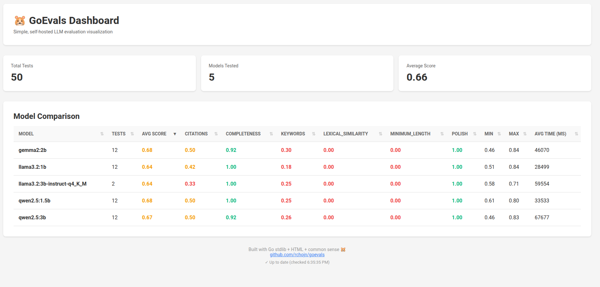

<div align="center">
  

  # GoEvals - LLM Evaluation Dashboard

  **Simple, self-hosted, Go-native dashboard for visualizing LLM evaluation results.**

  [](https://go.dev)
  [](LICENSE)

  
</div>

---

## Why GoEvals?

Existing LLM evaluation tools are either **Python-heavy** (complex setup), **cloud-only** (vendor lock-in), or **overkill** (full observability platforms).

**GoEvals** is different:
- ✅ **Single binary** - No Python, no Docker, no dependencies
- ✅ **Self-hosted** - Your data stays on your machine
- ✅ **Fast** - Starts in <100ms
- ✅ **Simple** - Works with standard JSONL format

Perfect for **Go developers building AI/ML applications** who want a lightweight eval dashboard.

---

## Quick Start

```bash
# Clone and run
git clone https://github.com/rchojn/goevals
cd goevals
go run main.go evals_sample.jsonl

# Visit http://localhost:3000
```

---

## What It Does

GoEvals reads **JSONL files** (one JSON object per line) and shows you:

- 📊 **Total tests** and **average score** across all evals
- 🤖 **Model comparison table** with min/max scores and response times
- 🎨 **Color-coded scores** (green >0.8, yellow 0.6-0.8, red <0.6)

That's it! No configuration, no databases, no complex setup.

---

## JSONL Format

Expected format (one line per eval):

```jsonl
{"model":"gpt-4","scores":{"combined":0.85},"response_time_ms":1234}
{"model":"claude-3","scores":{"combined":0.92},"response_time_ms":987}
```

**Required fields:**
- `model` - Model name (string)
- `scores.combined` - Overall score 0.0-1.0 (float)

**Optional fields:**
- `timestamp` - When eval ran (ISO8601)
- `test_id` - Test identifier (string)
- `response_time_ms` - Generation time (int)
- `scores.*` - Additional metrics (float)
- `question`, `response`, `expected` - Test details (string)
- `metadata` - Custom data (object)

---

## Compatible With

GoEvals works with eval outputs from:
- [gai/eval](https://github.com/maragudk/gai) (Go)
- [OpenAI Evals](https://github.com/openai/evals)
- Any tool that outputs JSONL

### Example: Log from Go

```go
f, _ := os.OpenFile("evals.jsonl", os.O_APPEND|os.O_CREATE|os.O_WRONLY, 0644)
json.NewEncoder(f).Encode(map[string]any{
    "model": "gpt-4",
    "scores": map[string]float64{"combined": 0.85},
    "response_time_ms": 1234,
})
```

---

## Tech Stack

**Current:**
- Pure Go stdlib (`net/http`, `html/template`, `encoding/json`)
- Zero dependencies
- Single file deployment

**Future (see [CHANGELOG.md](CHANGELOG.md)):**
- Type-safe templates ([a-h/templ](https://templ.guide))
- Dynamic interactions ([htmx](https://htmx.org))
- Charts ([Chart.js](https://www.chartjs.org))

---

## Contributing

⭐ Star the repo if you find it useful!

🐛 Report bugs in [Issues](https://github.com/rchojn/goevals/issues)

---

## License

MIT License - Free forever, use anywhere.

---

## Author

Built by [@rchojn](https://github.com/rchojn) - Go developer exploring AI/ML tooling.

Inspired by [evals.fun](https://evals.fun), [Langfuse](https://langfuse.com), and the Go community.

---

**Built with Go stdlib and common sense.** 🐹
